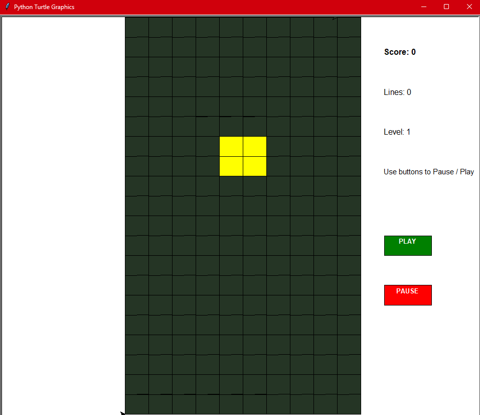

## 🎮 Tetris — Python Game

A fully functional Tetris game built using Python, Tkinter, and Turtle Graphics.
Designed with simple controls, a clean UI, and an easy-to-read code structure.

## 📸 Demo

  

## ✨ Features
- Play / Pause UI buttons  
- Hard drop functionality  
- Smooth block movement & rotation  
- Collision + stacking logic  
- Line clearing system  
- Custom UI (buttons instead of keyboard-only controls)  
- Clean multi-file Python architecture  

## 🚀 How to Run

### 1. Download the Game Files
Place these files in the same folder:
"cx10_Farhaaan.py"
"tetro_base.py"
"tetrominoes.py"

### 2. Open the Folder in VS Code
- Open VS Code  
- Click **File → Open Folder**  
- Select the Tetro folder  

### 3. Run the Game

**Option — VS Code Run Button**
- Open `cx10_Farhaaan.py`  
- Click **Run** (top-right)

## 🎮 Controls

| Action       | Input             |
| ------------ | ----------------- |
| Move Left    | ← Arrow           |
| Move Right   | → Arrow           |
| Rotate       | ↑ Arrow           |
| Soft Drop    | ↓ Arrow           |
| Hard Drop    | Space             |
| Pause / Play | On-screen buttons |

📄 License

Free for educational and personal use.

